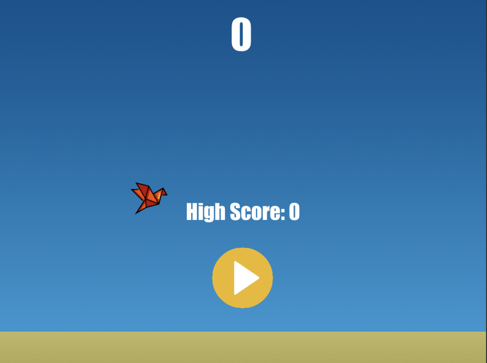
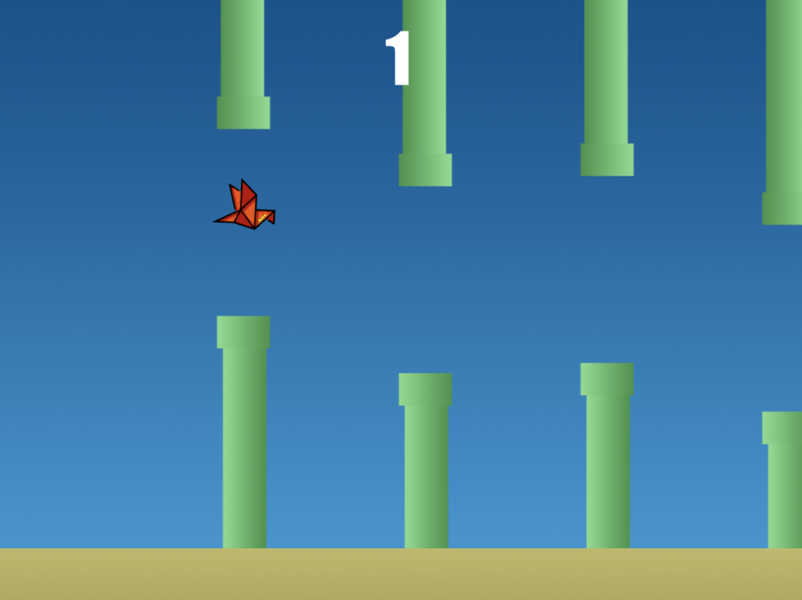
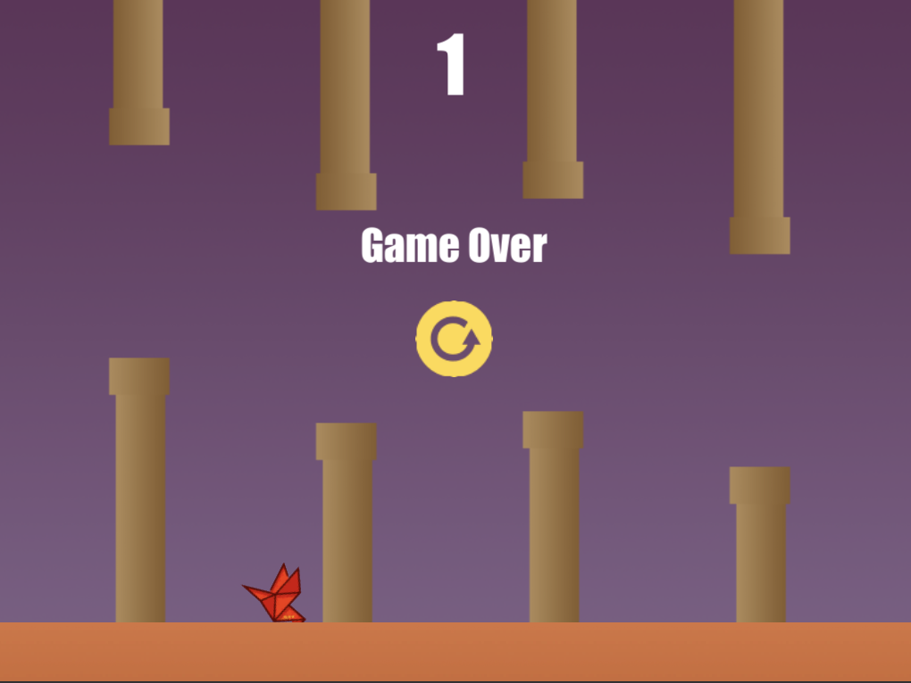

  <h1 align="center">Kappy Bird</h1>
  
PC / Mac Game of an Unity Project

 

 

### Keyword
> `Unity3D` 

## Contents 
<!-- toc -->
* [Introduction](#introduction)
* [Release](#release)
* [Environment](#environment)
* [Credit](#credit)
* [Installation](#installation)
* [Author](#author)
* [Screenshots](#screenshots)
* [Contact](#contact)
* [License](#license)

<!-- toc stop -->

## Introduction

Simular to Flappybird. Click your mouse to hop. See how far you can go.

## Release
- [Release Page](https://github.com/tavik000/KappyBird/releases/tag/v1.0.3)

## Environment
- MacOS: 10.14.1  
- Unity: 2018.3.2f1  
- Visual Studio: 7.6.11  
- Adobe Photoshop CC 2019: 20.0.0 Release

#### Quick Links
- [Develop and Publish Flappy Bird in 3 Hours With Unity3D](https://www.youtube.com/watch?v=A-GkNM8M5p8)

## Credit
- Icon made by Chanut, Smashicons, Freepik from [www.flaticon.com](www.flaticon.com) 
- Sound Effect from [freesound.org](www.freesound.org)

## Author
- [Key](https://github.com/tavik000)  

## Screenshots

Gameplay  
  
  
  

**If you like this, please leave a star.**

-----

## Contact

Email:  Key <tavik002@gmail.com>

-----
## License
MIT License

Copyright (c) 2018 key

Permission is hereby granted, free of charge, to any person obtaining a copy
of this software and associated documentation files (the "Software"), to deal
in the Software without restriction, including without limitation the rights
to use, copy, modify, merge, publish, distribute, sublicense, and/or sell
copies of the Software, and to permit persons to whom the Software is
furnished to do so, subject to the following conditions:

The above copyright notice and this permission notice shall be included in all
copies or substantial portions of the Software.

THE SOFTWARE IS PROVIDED "AS IS", WITHOUT WARRANTY OF ANY KIND, EXPRESS OR
IMPLIED, INCLUDING BUT NOT LIMITED TO THE WARRANTIES OF MERCHANTABILITY,
FITNESS FOR A PARTICULAR PURPOSE AND NONINFRINGEMENT. IN NO EVENT SHALL THE
AUTHORS OR COPYRIGHT HOLDERS BE LIABLE FOR ANY CLAIM, DAMAGES OR OTHER
LIABILITY, WHETHER IN AN ACTION OF CONTRACT, TORT OR OTHERWISE, ARISING FROM,
OUT OF OR IN CONNECTION WITH THE SOFTWARE OR THE USE OR OTHER DEALINGS IN THE
SOFTWARE.

[⬆ Back to top](#contents)

**All Copyright Reserved**
